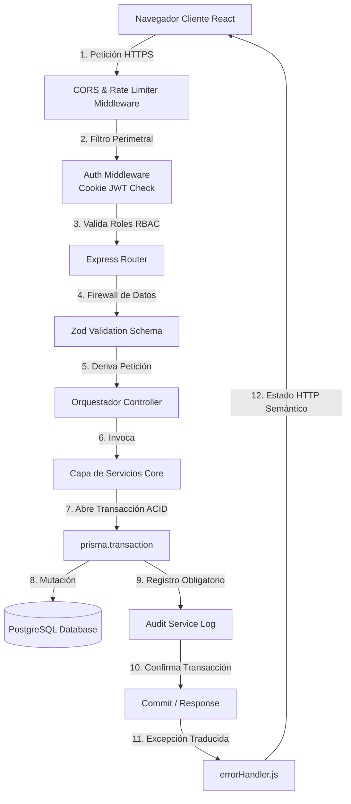
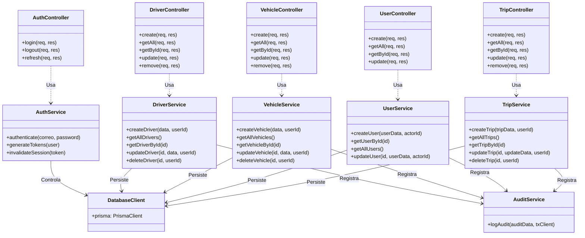

# Métodos y Diagramas de Clase - Novapalma Logística 🌴
## Planos de Ingeniería y Arquitectura del Sistema

Este documento presenta los diagramas de ingeniería y la arquitectura de clases/módulos del sistema de gestión logística Novapalma, detallando los flujos de control y la estructura lógica.

---

### 1. DIAGRAMA DE FLUJO DE ARQUITECTURA (CICLO DE VIDA DE LA PETICIÓN)

El sistema opera bajo un flujo de capas de alta seguridad. Cada petición HTTP cruza barreras de validación y de autenticación antes de ejecutar lógica en la base de datos de manera atómica:

---

### 2. DIAGRAMA DE CLASES LÓGICAS (MÓDULOS DE NEGOCIO)

Aunque JavaScript (Node.js + Express) utiliza un enfoque de módulos funcionales y de exportación de servicios en lugar de herencia clásica, la arquitectura sigue un modelo orientado a servicios que puede diagramarse de forma equivalente a clases lógicas.

---

### 3. CONTRATOS DE MÉTODOS Y SIGNATURAS TÉCNICAS

A continuación se detallan las signaturas de los métodos clave que implementa cada capa de servicios del backend, garantizando la consistencia del dominio.

#### 3.1. Módulo: `TripService` (Viajes)
*   **`createTrip(tripData: TripInput, userId: String): Promise<Trip>`**
    *   *Entrada:* Un objeto con los datos del viaje (ticket, fecha, tonelaje, flete pactado, conductor, vehículo) y el UUID del despachador autenticado.
    *   *Salida:* El viaje creado con relaciones cargadas y confirmación de auditoría forense inyectada.
    *   *Excepciones:* `Error` si el vehículo/conductor están inactivos, si el ticket está repetido o si falla la integridad relacional.
*   **`updateTrip(id: String, updateData: Partial<TripInput>, userId: String): Promise<Trip>`**
    *   *Entrada:* El UUID del viaje, los campos a modificar y el UUID del administrador/operador que realiza la edición.
    *   *Salida:* Registro modificado con comisiones de chofer re-calculadas automáticamente.

#### 3.2. Módulo: `AuditService` (Auditoría Forense)
*   **`logAudit(auditData: AuditInput, tx: Prisma.TransactionClient): Promise<AuditLog>`**
    *   *Entrada:* Objeto con la información del actor (`userId`), entidad alterada (`entity`), acción realizada (`CREATE/UPDATE/DELETE`) y snapshots JSON (`oldValues`, `newValues`). Recibe el cliente transaccional activo `tx`.
    *   *Salida:* Registro inmutable insertado en la tabla `audit_logs`.
    *   *Importancia:* Al requerir el argumento `tx`, se ancla a la misma transacción ACID que la mutación de origen. Si la auditoría falla, todo se revierte.

#### 3.3. Módulo: `UserService` (Seguridad y Usuarios)
*   **`createUser(userData: UserInput, actorId: String): Promise<User>`**
    *   *Entrada:* Datos de perfil del usuario corporativo y contraseña en texto plano, junto con el ID del administrador ejecutor.
    *   *Salida:* Objeto usuario creado con la contraseña hasheada de forma asíncrona mediante Bcrypt (10 salt rounds). Excluye de forma segura el campo `password` de retornos API.
